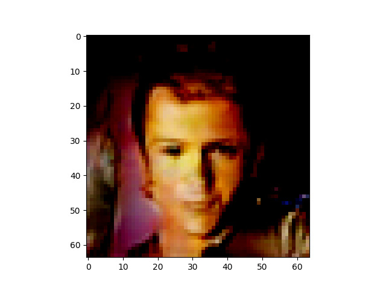
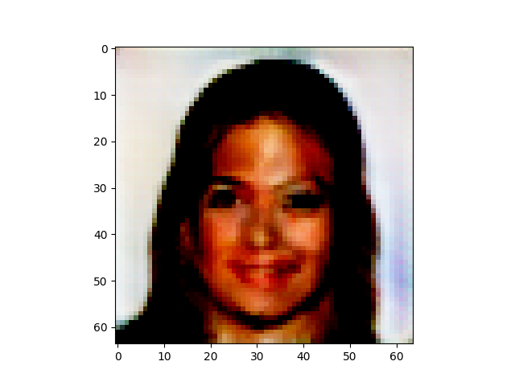

# GAN Implementation

## Descrition of the project

A simple implementation of a GAN with pytorch that allows to generate new heads.

## How to load the data

You need to first download the data using this link. http://mmlab.ie.cuhk.edu.hk/projects/CelebA.html Then you can extract the zip folder img_align_celeba.zip and put the image in a subfolder (faces for examples). 

## How to train

```bash
python main.py
```

## Generated samples 

Theses samples were generated using the generator.





